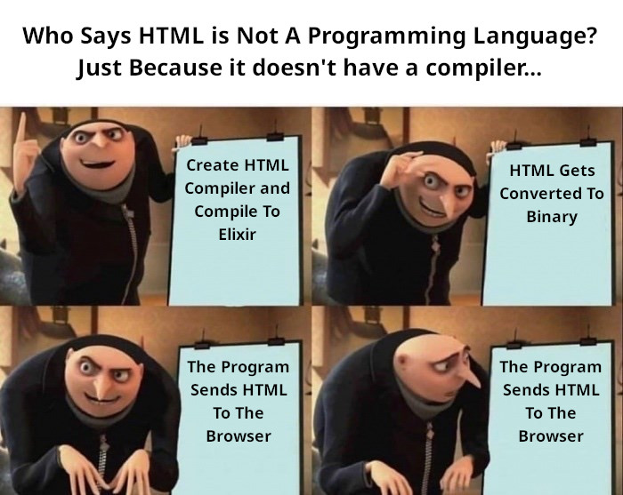

# HTMLC (HTML Conpiler)

Compiles HTML to Elixir.
Who says HTML is not a programming language?

This module is actually just another templating engine (and a really fast one).



## Installation

```shell
go get github.com/tkdeng/htmlc
```

## Usage

```go
import (
  "github.com/tkdeng/htmlc"
)

func main(){
  htmlc.Compile("./src", "./output.exs")
}
```

## Using The Binary

You can opptionally just use the binary instead of importing the module.

```shell
./htmlc --src="./src" --out="./output.exs"
```

You can also specify a port number, to automatically start a static-like http server.

```shell
./htmlc --port="3000"
```

Note: by default, "--src" is set to the current working directory,
and "--out" is set to the same directory, with the file name set to the base folder name.

You can also call this method without the "--src" or "--port"

```shell
./htmlc --src="/var/www/html"
# is equivalent to
./htmlc --src="/var/www/html"

./htmlc --port="3000"
# is equivalent to
./htmlc 3000

# so you can use the method like this
./htmlc /var/www/html 3000

# and the order doesnt matter, as long as the port number is a valid uint16
./htmlc 3000 /var/www/html

# note: the output file must still be specified with "--out"
./htmlc --out="html.exs" /var/www/html 3000
```
